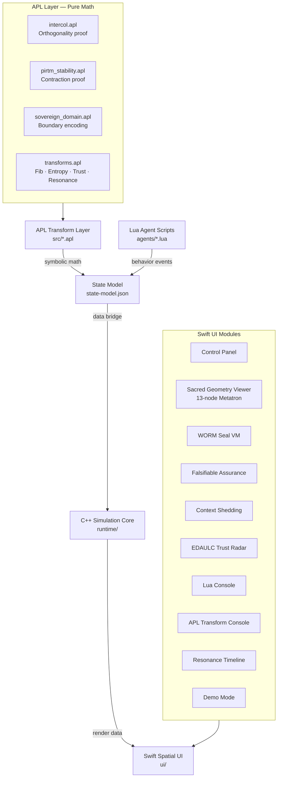
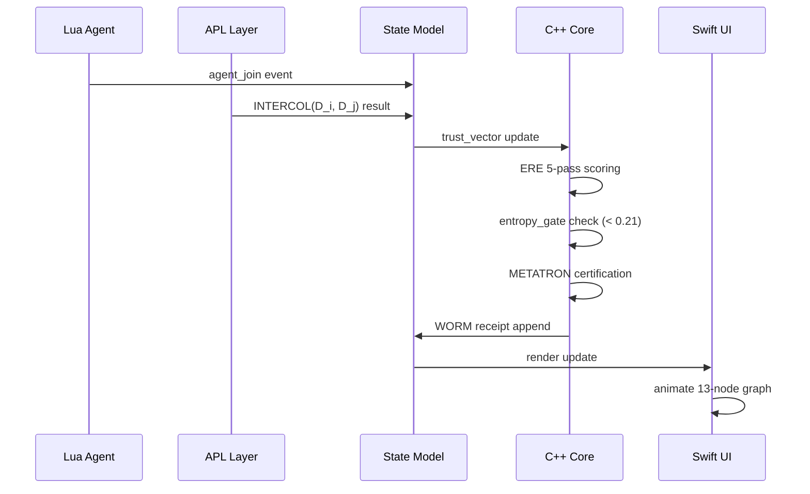
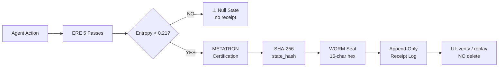
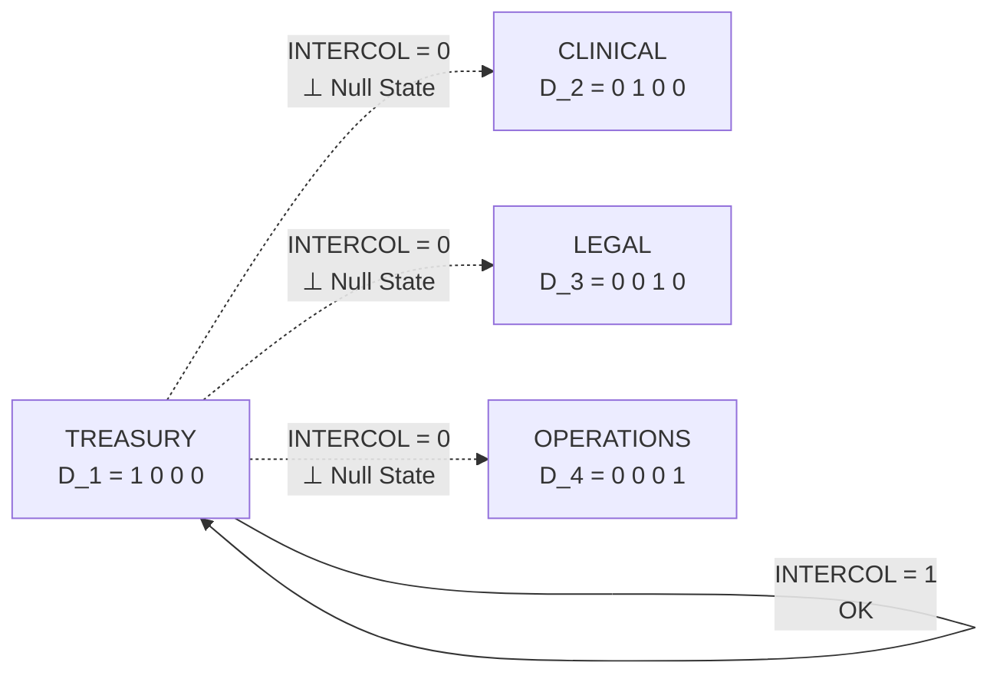
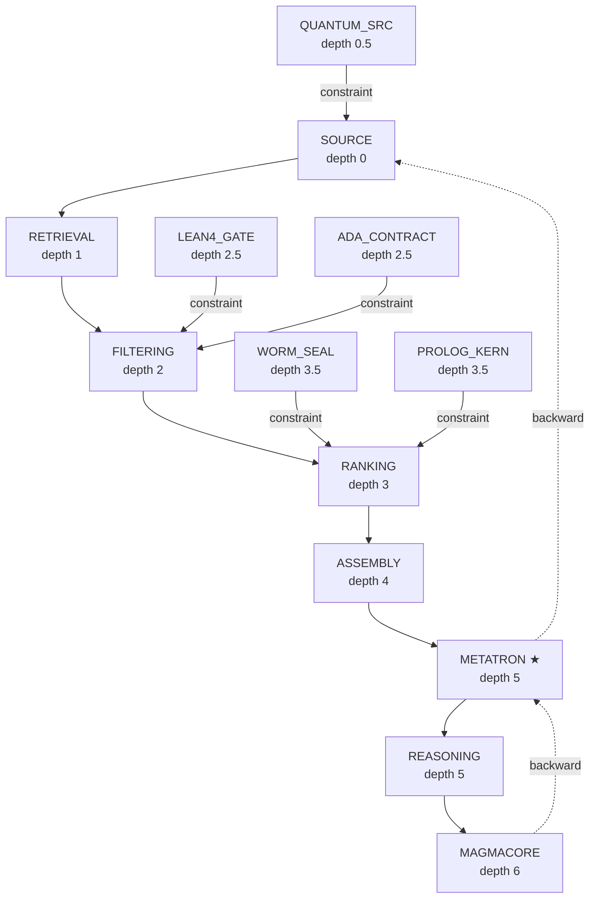

# INTERCOL UI — System Architecture

**Author:** Ahmad Ali Parr · SnapKitty Collective · 2026

---

## Stack Overview



---

## Data Flow



---

## WORM Receipt Flow



---

## EDAULC Trust Vector (7-axis)

```mermaid
radar
    title EDAULC Trust Axes
    "coherence" : 0
    "provenance" : 0
    "reversibility" : 0
    "consent" : 0
    "auditability" : 0
    "semantic_alignment" : 0
    "contradiction_resistance" : 0
```

Each axis: `0.0–1.0`. Not boolean. Trust is a vector, not a flag.

---

## INTERCOL Domain Space



Cross-domain transitions are **undefined**, not rejected.  
The state machine has no rule for these edges.

---

## METATRON 13-Node Topology



METATRON reads ALL nodes forward AND backward.  
The intersection of both views is the cage.

---

## File Map

| File | Purpose | Used by |
|---|---|---|
| `src/intercol.apl` | Domain orthogonality proofs | APL Console (M8), Demo (M10) |
| `src/pirtm_stability.apl` | PIRTM contradiction proof | APL Console (M8) |
| `src/sovereign_domain.apl` | Domain boundary encoding | Domain model, C++ core |
| `src/transforms.apl` | Fib · Entropy · Trust · Resonance | APL Console (M8), Demo (M10) |
| `src/state-model.json` | Full UI state schema | C++ core, Swift UI, Lua |
| `docs/INTERCOL.md` | Formal specification | README, LinkedIn post |
| `docs/resonance.html` | Resonance Machine visualizer | GitHub Pages |
| `ARCHITECTURE.md` | This file | Codex, team |

---

*Ahmad Ali Parr · SnapKitty Collective · 2026*
