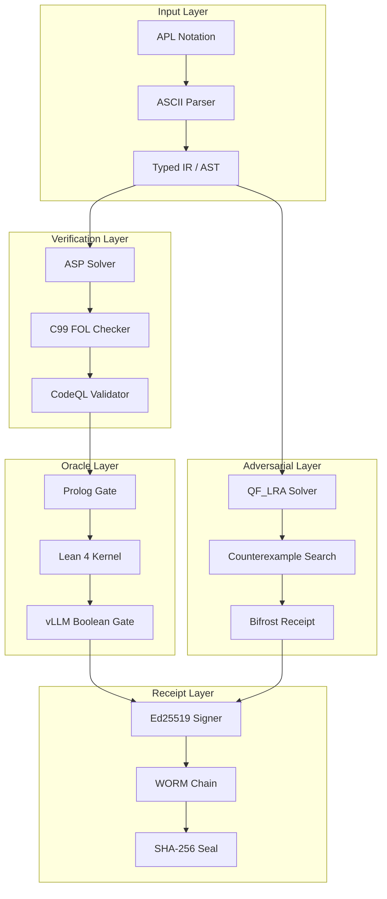
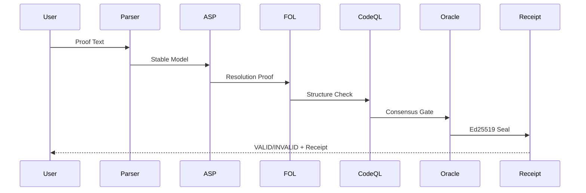
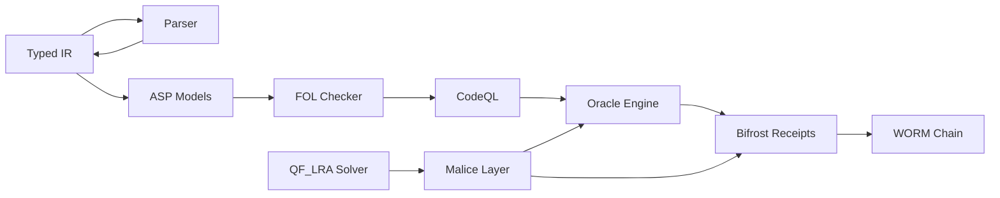
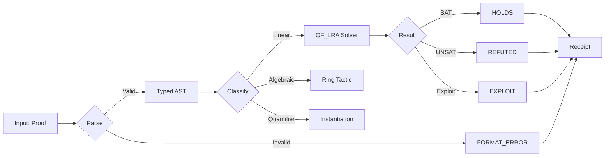
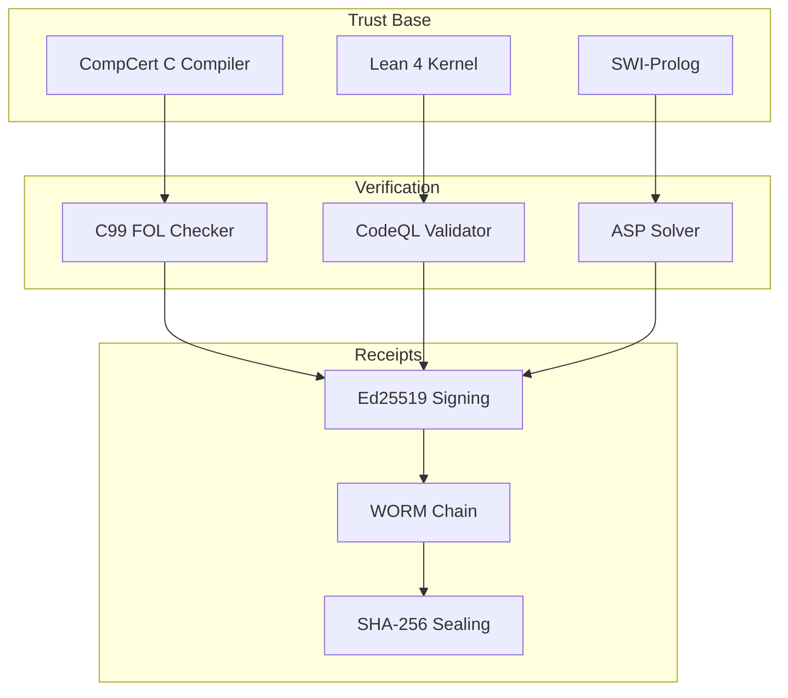
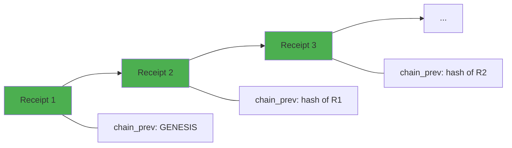

# MATHLIB5 Architecture

## System Overview

```mermaid
graph TB
    subgraph "Input Layer"
        A[APL Notation] --> B[ASCII Parser]
        B --> C[Typed IR / AST]
    end

    subgraph "Verification Layer"
        D[ASP Solver] --> E[C99 FOL Checker]
        E --> F[CodeQL Validator]
    end

    subgraph "Oracle Layer"
        G[Prolog Gate] --> H[Lean 4 Kernel]
        H --> I[vLLM Boolean Gate]
    end

    subgraph "Adversarial Layer"
        J[QF_LRA Solver] --> K[Counterexample Search]
        K --> L[Bifrost Receipt]
    end

    subgraph "Receipt Layer"
        M[Ed25519 Signer] --> N[WORM Chain]
        N --> O[SHA-256 Seal]
    end

    C --> D
    C --> J
    F --> G
    I --> M
    L --> M
```

## Verification Chain

```mermaid
sequenceDiagram
    participant U as User
    participant P as Parser
    participant A as ASP
    participant F as FOL
    participant C as CodeQL
    participant O as Oracle
    participant R as Receipt

    U->>P: Proof Text
    P->>A: Stable Model
    A->>F: Resolution Proof
    F->>C: Structure Check
    C->>O: Consensus Gate
    O->>R: Ed25519 Seal
    R-->>U: VALID/INVALID + Receipt
```

## Module Dependencies

```mermaid
graph LR
    IR[Typed IR] --> Parser
    Parser --> IR
    IR --> ASP[ASP Models]
    ASP --> FOL[FOL Checker]
    FOL --> CodeQL
    CodeQL --> Oracle[Oracle Engine]
    Oracle --> Receipts[Bifrost Receipts]
    Receipts --> WORM[WORM Chain]

    QF_LRA[QF_LRA Solver] --> Malice[Malice Layer]
    Malice --> Oracle
    Malice --> Receipts
```

## Data Flow

```mermaid
flowchart LR
    A[Input: Proof] --> B{Parse}
    B -->|Valid| C[Typed AST]
    B -->|Invalid| D[FORMAT_ERROR]

    C --> E{Classify}
    E -->|Linear| F[QF_LRA Solver]
    E -->|Algebraic| G[Ring Tactic]
    E -->|Quantifier| H[Instantiation]

    F --> I{Result}
    I -->|SAT| J[HOLDS]
    I -->|UNSAT| K[REFUTED]
    I -->|Exploit| L[EXPLOIT]

    J --> M[Receipt]
    K --> M
    L --> M
    D --> M
```

## Security Model

```mermaid
graph TB
    subgraph "Trust Base"
        A[CompCert C Compiler]
        B[Lean 4 Kernel]
        C[SWI-Prolog]
    end

    subgraph "Verification"
        D[C99 FOL Checker]
        E[CodeQL Validator]
        F[ASP Solver]
    end

    subgraph "Receipts"
        G[Ed25519 Signing]
        H[WORM Chain]
        I[SHA-256 Sealing]
    end

    A --> D
    B --> E
    C --> F
    D --> G
    E --> G
    F --> G
    G --> H
    H --> I
```

## Receipt Chain

```mermaid
graph LR
    R1[Receipt 1] --> R2[Receipt 2]
    R2 --> R3[Receipt 3]
    R3 --> R4[...]

    R1 --- H1[chain_prev: GENESIS]
    R2 --- H2[chain_prev: hash of R1]
    R3 --- H3[chain_prev: hash of R2]

    style R1 fill:#4CAF50
    style R2 fill:#4CAF50
    style R3 fill:#4CAF50
```
