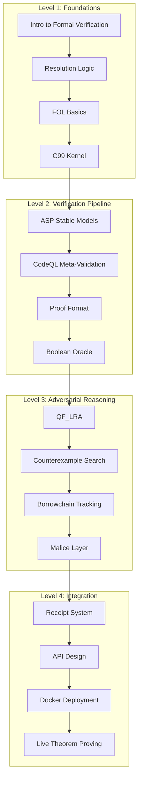

# MATHLIB5 Module Index

## Curriculum

### Level 1: Foundations
1. **Introduction to Formal Verification** — What proofs are, why they matter
2. **Resolution Logic** — propositional logic, clausal form, resolution rule
3. **FOL Basics** — predicates, variables, unification, Robinson's algorithm
4. **C99 Kernel** — arena allocation, deterministic execution, trust base

### Level 2: Verification Pipeline
5. **ASP Stable Models** — answer set programming, constraint satisfaction
6. **CodeQL Meta-Validation** — Datalog predicates, structural checks
7. **Proof Format** — resolution proofs, clause IDs, derivation steps
8. **Boolean Oracle** — constrained decoding, zero-natural-language gate

### Level 3: Adversarial Reasoning
9. **QF_LRA** — quantifier-free linear real arithmetic
10. **Counterexample Search** — simplex-style, bound propagation
11. **Borrowchain Tracking** — ownership, borrowing, use-after-free
12. **Malice Layer** — adversarial refutation, exploit detection

### Level 4: Integration
13. **Receipt System** — Ed25519 signing, WORM chain, SHA-256 sealing
14. **API Design** — OpenAI-compatible endpoints, health checks
15. **Docker Deployment** — CUDA, Lean, SWI-Prolog, CompCert
16. **Live Theorem Proving** — solving real theorems, breaking records

## Module Map

## File Reference

| Module | Files | Description |
|--------|-------|-------------|
| FOL Checker | `layers/fol/src/fol_resolution_checker.c` | C99 resolution proof checker |
| QF_LRA Solver | `malice_layer2/solver/qf_lra_solver.c` | Linear arithmetic counterexample finder |
| Boolean Parser | `meta_oracle_engine/engine/boolean_parser.py` | Constrained decoding parser |
| Prolog Gate | `meta_oracle_engine/kernel/prolog_gate.py` | Structural validation gate |
| Bifrost Sealer | `meta_oracle_engine/receipts/bifrost_sealer.py` | Ed25519 receipt generation |
| Oracle Engine | `meta_oracle_engine/engine/oracle_engine.py` | vLLM boolean verification |
| API Server | `meta_oracle_engine/api/openai_compat.py` | OpenAI-compatible API |
| Malice Harness | `malice_layer2/harness/malice_harness.py` | Adversarial attack orchestrator |
| Sorry Solver | `malice_layer2/solver/sorry_solver.py` | Automated sorry closing |
| ASP Borrowchain | `malice_layer2/asp/borrows.lp` | Ownership tracking |
| Test Suite | `test/run_all.py` | Comprehensive test runner |
