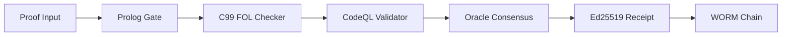

# MATHLIB5 User Guide

## Overview

MATHLIB5 is a verified symbolic compute pipeline that translates APL notation into verified kernels, using ASP/Prolog/C as the verification backbone.

## Installation

### Prerequisites

- GCC (C99 compiler)
- Python 3.10+
- SWI-Prolog (optional, for full Prolog gate)
- Lean 4 (optional, for deep type verification)
- clingo (optional, for ASP solver)

### Build

```bash
# Clone
git clone https://github.com/user/mathlib5.git
cd mathlib5

# Build FOL Checker
gcc -std=c99 -pedantic -Wall -Wextra -O2 \
    layers/fol/src/fol_resolution_checker.c \
    -o layers/fol/src/fol_check

# Build QF_LRA Solver
gcc -std=c99 -pedantic -Wall -Wextra -O2 -lm \
    malice_layer2/solver/qf_lra_solver.c \
    -o malice_layer2/solver/qf_lra_solver

# Install Python dependencies
pip install -r requirements.txt
```

## Quick Start

### Verify a Proof

```bash
# Create a proof file
cat > example.proof << 'EOF'
# Modus Ponens: P→Q, P ⊢ Q
0 ~P Q
1 P
2 Q from 0 1
3 from 2
EOF

# Verify
layers/fol/src/fol_check example.proof
# Exit 0 = VALID, Exit 1 = INVALID
```

### Use the Oracle API

```bash
# Start the server
python -m meta_oracle_engine.api.openai_compat

# Verify via API
curl -X POST http://localhost:8000/v1/verify \
  -H "Content-Type: application/json" \
  -d '{"proof": "0 ~P Q\n1 P\n2 Q from 0 1\n3 from 2"}'

# Response:
# {"valid": true, "receipt": {...}, "stages": {...}}
```

### Run the Test Suite

```bash
python test/run_all.py
```

## Proof Format

MATHLIB5 uses a resolution proof format:

```
# Comments start with #
# Line format: ID LITERAL... [from ID1 ID2]
# Literals: ~P(X) means negated, P(a) means positive
# Variables: uppercase first letter (X, Y, Z)
# Constants: lowercase (a, b) or numbers

0 ~P Q        # Axiom: ~P ∨ Q
1 P           # Axiom: P
2 Q from 0 1  # Resolution: 0 and 1 → Q
3 from 2      # Resolution: 2 → empty clause (□)
```

## Architecture



## Modules

### Core Verification
- **`layers/fol/`** — C99 FOL resolution checker
- **`layers/asp/`** — ASP stable model constraints
- **`layers/codeql/`** — CodeQL meta-validator

### Oracle Engine
- **`meta_oracle_engine/`** — Boolean verification oracle
- **`meta_oracle_engine/engine/`** — vLLM + constrained decoding
- **`meta_oracle_engine/receipts/`** — Ed25519 + WORM chain

### Adversarial Layer
- **`malice_layer2/`** — QF_LRA counterexample solver
- **`malice_layer2/solver/`** — Linear arithmetic refutation
- **`malice_layer2/asp/`** — Borrowchain ownership tracking

### Notation
- **`layers/ir/`** — Typed intermediate representation
- **`layers/parser/`** — Megaparsec surface parser
- **`layers/revered/`** — Reverse Unicode notation

## API Reference

### POST /v1/verify

Verify a proof.

**Request:**
```json
{
  "proof": "0 ~P Q\n1 P\n2 Q from 0 1\n3 from 2",
  "format": "resolution"
}
```

**Response:**
```json
{
  "valid": true,
  "receipt": {
    "tx_id": "bifrost-...",
    "status": "VALID",
    "proof_hash": "sha256:...",
    "seal": "Ed25519:..."
  },
  "stages": {
    "prolog": {"valid": true, "status": "PYTHON_FALLBACK_VALID"},
    "kernel": {"valid": true, "exit_code": 0},
    "lean": {"valid": true}
  }
}
```

### GET /health

Health check.

**Response:**
```json
{
  "status": "MAX_KINETIC_TEMP",
  "persona": "META_THEOREM_ORACLE_NODE_0x1A",
  "engine": "meta_oracle_engine/0.1.0",
  "vllm": false
}
```

## Receipts

Every verification produces a cryptographically sealed receipt:

```json
{
  "tx_id": "bifrost-65be2f912e8615b5-1783664461",
  "status": "VALID",
  "proof_hash": "sha256:65be2f912e8615b5...",
  "timestamp": 1783664461.07,
  "seal": "Ed25519:eb0d9fa52818e3bb...",
  "chain_prev": "c9fdf22c81fc21e6..."
}
```

Receipts are append-only (WORM: Write Once Read Many).

## License

Apache 2.0. See [LICENSE](LICENSE).
